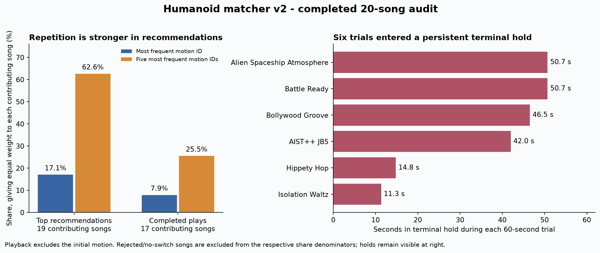
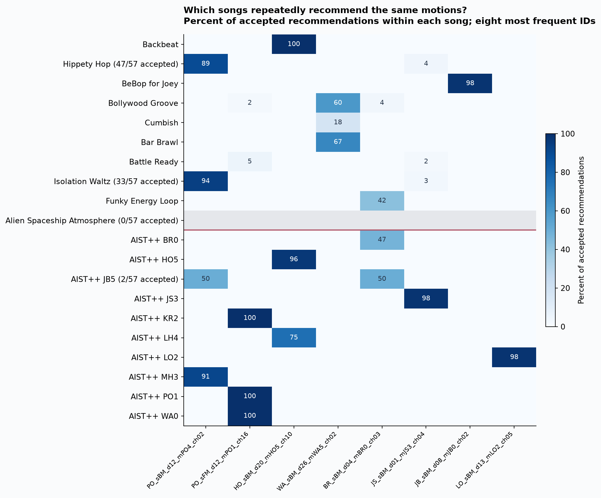

# Interpretation of the completed 20-song matcher v2 experiment

**Your impression is partly correct: a small set of motions repeatedly tops the rankings. Actual playback uses more distinct motion IDs, but style concentration and persistent terminal holds remain. The evidence does not justify blaming the ONNX embedding model alone.**

## Validation and denominators

All 20 trials completed. All raw artifact hashes, prepared audio hashes and frozen input hashes match. Every trial contains 57 delivered retrievals (1,140 total), and traces reach 59.96 seconds. There are 994 accepted results with motions, 83 completed motion switches and 40 distinct played motion IDs. No same-ID consecutive replay completed.

Shares below first normalize within a song and then average across contributing songs. Recommendations use 19 songs with at least one accepted motion; playback uses 17 songs with at least one completed switch. Therefore these stages have different denominators. They describe concentration, not a statistically significant defect. No motion crosses both the preregistered 20% share and five-song prevalence thresholds in the full-sample recommendation table.

## Repeated recommendations

| Motion ID | Share of top recommendations | Songs where it ranks first at least once |
|---|---:|---:|
| `gPO_sBM_cAll_d12_mPO4_ch02` | 17.1% | 4/19 |
| `gPO_sFM_cAll_d12_mPO1_ch16` | 16.2% | 5/19 |
| `gHO_sBM_cAll_d20_mHO5_ch10` | 14.3% | 3/19 |
| `gWA_sBM_cAll_d26_mWA5_ch02` | 7.6% | 3/19 |
| `gBR_sBM_cAll_d04_mBR0_ch03` | 7.5% | 4/19 |

The leading three account for 47.6% and the leading five for 62.6% of recommendations. Ten of the 19 contributing songs have one motion at the top for at least 90% of accepted retrievals. This within-song stability is real, but overlapping windows and consistent musical style naturally produce correlated rankings.

The leading played motion accounts for 7.9%, and the five leading played motions account for 25.5% of completed plays. The exact top recommendation is not always the motion that passes transition selection. Diversity across IDs also does not guarantee visual diversity: Popping motions account for 43.8% of song-balanced plays (56.4% among catalog-song trials). These are descriptive style shares, not an expectation that every style should be equally frequent.

## Where the concentration appears

**External audio:** among the nine rhythmic CC0 tracks, 83.7% of embedding-only top track choices fall in the Jazz Ballet (JB) family. The combined runtime ranking assigns 81.5% to that family. Individual JB5 is the top combined track in five of the nine songs and has a 29.0% share. Thus concentration already exists in feature/catalog retrieval for this external sample. It could reflect feature geometry, catalog representation or the limited sample; this run cannot isolate encoder training as the cause.

**Catalog controls:** all 570 live retrievals across the ten AIST++ songs correctly retrieve their own music ID as the top combined track. All 300 deterministic embedding-only observations also retrieve their own music ID. Yet the following accepted motion rankings occur:

| Input song | Top combined track | Dominant motion recommendation | Frequency |
|---|---|---|---:|
| KR2 | KR2 in 57/57 | `gPO_sFM_cAll_d12_mPO1_ch16` | 57/57 |
| PO1 | PO1 in 57/57 | `gPO_sFM_cAll_d12_mPO1_ch16` | 57/57 |
| WA0 | WA0 in 57/57 | `gPO_sFM_cAll_d12_mPO1_ch16` | 57/57 |
| MH3 | MH3 in 57/57 | `gPO_sBM_cAll_d12_mPO4_ch02` | 52/57 |
| LH4 | LH4 in 57/57 | `gHO_sBM_cAll_d20_mHO5_ch10` | 43/57 |

This locates a major effect after track recognition. In `music_motion_catalog.py:1006`, the genre score gives 65% weight to a normalized tag-derived prior and 35% to normalized genre similarity. Lines 1060-1081 retain only the winning genre (plus a near-tied second genre) before ranking compatible motions. The manually defined Electronic-tag fallback routes many styles into PO. These rules can exclude the genre of a very strong individual track match. The top reported track list is computed before this gate, so its first entry need not supply the selected motion.

For example, the 29th live retrieval of KR2 scores its own track at 0.970 versus 0.621 for PO1, but the winning genre is PO and the chosen motion comes from PO1. This shows a strong match being overridden; it does not by itself prove the dance is aesthetically wrong, since AIST dance styles and broad audio tags are not identical concepts. A tag-prior ablation is needed to measure the causal contribution of that rule.

**Library size is not a sufficient explanation:** the library contains 411 preflight-passed motions and 60 music IDs. Per-genre motion counts range from 36 to 43, with PO having 43/411 (10.5%). The library does not contain a comparably overwhelming proportion of PO motions. Uniform selection is still not the appropriate expected distribution.

## Rejection and transition problems

| Song | Accepted retrievals | Completed switches | Terminal hold |
|---|---:|---:|---:|
| Hippety Hop | 47/57 | 5 | 14.8 s |
| Bollywood Groove | 57/57 | 0 | 46.5 s |
| Battle Ready | 57/57 | 0 | 50.7 s |
| Isolation Waltz | 33/57 | 5 | 11.3 s |
| Alien Spaceship Atmosphere | 0/57 | 0 | 50.7 s |
| AIST++ JB5 | 2/57 | 1 | 42.0 s |

Bollywood Groove and Battle Ready have 57/57 valid recommendations but never finish a transition. The trace remains in loading until the first terminal state; the logged reason is that bridge preparation did not finish in time. Later recommendations cannot recover them: `prepare()` returns immediately when `self.held` is set (`realtime_music_humanoid_matcher_v2.py:1181`), and the sample path retains the terminal pose. This is a separate transition/recovery issue, not repeated ONNX selection.

Hippety Hop also ends in a preparation-timeout hold. Isolation Waltz, the ambient control and JB5 log infeasible candidate/replay bridges. Their logs identify Hermite position-limit violations; this analysis does not establish whether the underlying cause is endpoint derivatives, available trajectories or the bridge search.

The ambient control is rejected in all 57 runtime retrievals, as intended. Its deterministic diagnostic accepts only the first of 30 windows before the consecutive-window gate takes effect; the earlier report's 100% conditional motion share for this control refers to that single accepted window. JB5 is rejected as non-dance/ambient in 55/57 live retrievals despite its own track being correctly recognized. Its conditional recommendation percentages are based on only two observations and must not be treated as robust evidence. Hippety Hop and Isolation Waltz also lose 10/57 and 24/57 retrievals to that gate.

## Sensitivity and limits

The first-pass diagnostic (before any loop) keeps the leading external recommendation at 20.3%, and the leading catalog recommendation at 30.0%. Removing each catalog song and all its associated motions still gives `gPO_sBM_cAll_d12_mPO4_ch02` a 23.7% leading recommendation share (22.6% before looping); however, that motion occurs in only three of the ten leave-music-out songs. Repetition is therefore not explained solely by loops or exact self-matches.

The earlier `genre_accepted` field measures the highest-scored style, which can differ from the winning motion's genre when a second genre is admitted. Recomputing from actual motion IDs gives PO 34.3% of top recommendations, versus 31.8% for the highest-scored-style field. The accompanying JSON records the motion-derived values.

There are only nine external rhythmic songs, one ambient control, ten in-sample controls and one fixed startup seed. All trials share the seeded startup motion by design. The aggregate excludes that initial play, but holds and sparse accepted sets still affect interpretation. Windows are correlated and are not independent sample replicates. There is no human rating of visual similarity or dance quality, and no model/genre-prior ablation has yet been run.

## Suggested next changes to test

1. Test tag-prior strength and hard genre gating with the same frozen songs. Preserve strong track evidence and measure genre/motion concentration together with compatibility, rather than adding randomness immediately.
2. Investigate loading deadlines and add a controlled recovery path after terminal hold. Recheck Bollywood Groove and Battle Ready, then the full set.
3. Recalibrate the ambient rejection gate using the successful ambient rejection alongside JB5, Hippety Hop and Isolation Waltz, where valid music is often rejected.
4. After those targeted checks, assess feature/catalog similarity on more unseen songs and multiple startup seeds. Compare actual choreography families as well as individual motion IDs.

No matcher, model or experiment inputs were modified during this analysis. The raw report is preserved; these files are an interpretive supplement.

