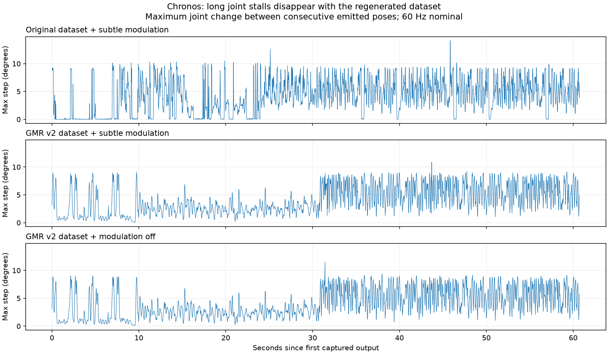

# Chronos motion continuity review — 2026-09-17

The requested playback completes its transitions, but the original dataset contains long near-stationary joint plateaus followed by abrupt restarts. The tested remedy is to select the existing GMR v2 dataset and turn pose modulation off. This removes the source plateaus and output joint clipping in this test; occasional scheduling jitter remains.

## Measured runs

All three runs used GUI, speaker playback, authored timing, seed 42, and a 60-second audio limit. A passive wrapper captured every post-clipping player pose and its exact playback metadata. Times below are seconds since the first captured output, not audio timestamps. The generated trace files use separate names; the requested original trace files were preserved.

| Measurement | Original | GMR v2 | GMR v2, modulation off |
|---|---:|---:|---:|
| Completed bridges | 9 | 8 | 8 |
| Terminal holds | 0 | 0 | 0 |
| Clipped joint samples | 411 | 578 | 0 |
| Frames containing clipping | 238 | 292 | 0 |
| Peak displayed acceleration (rad/s²) | 725.8 | 578.9 | 340.5 |
| Longest output interval (ms) | 53.95 | 61.52 | 54.34 |
| Deadline misses | 3 | 3 | 3 |

All bridges in each run completed without replay fallback or a terminal hold. No captured executing-bridge frame was clipped. Existing regression tests passed: 38 bridge tests and 24 matcher tests. The trace verifier passed for all three runs.

The peak output accelerations are finite-difference estimates using measured emission intervals. They are sensitive to scheduling jitter and are not the same quantity as continuous source-trajectory extrema. The retrieved motion sequence changed when the dataset changed, so aggregate maxima are descriptive A/B results, not a perfectly paired experiment.

## Causes

1. **Old motion data contains stalls.** The initial `gLO_sBM_cAll_d13_mLO2_ch02` clip has near-stationary joint intervals at source time 0.45–2.12 s, 2.43–4.30 s, and 5.02–6.93 s. Here near-stationary means every joint changes by less than 0.0001 rad per source frame. This describes joint plateaus, not necessarily a stationary floating base. Playback reaches these plateaus before the first transition. Other selected original clips have similar plateaus. The first clip records 516 collision-adjusted frames; the old exporter progressively scales the entire joint delta toward the preceding safe pose when collision clearance fails (`gmr_retarget_smpl_headless.py:475–511`). Together with the repeated near-zero deltas, this supports collision filtering as the cause of the stalls.

2. **Continuous interpolation does not remove bad source dynamics.** Original clips contain repeated steps of 0.15708 rad (9 degrees) at 60 FPS. Their old per-frame velocity bound does not constrain acceleration or jerk. `AuthoredTrajectory` estimates derivatives and interpolates through those poses, so a plateau followed by a rapid restart remains sharp. Three of the six played original clips exceed the configured 1600 rad/s² continuous acceleration bound between samples. The bridge boundary checks only cover the joins, not entire source clips.

3. **Authored timing leaves pose modulation on.** `AuthoredPlayback.sample` selects a constant 1× clock for this option but still adds pose offsets. Default subtle modulation adds wrist and knee offsets without accounting for remaining joint-range margin. `MujocoHumanoidPlayer._write_frame` clips the result afterward. The corrected-dataset run still had 578 clipped joint samples; the same configuration with `--pose-modulation-mode off` had zero, within a 1e-8 rad comparison tolerance.

4. **Emission jitter remains.** Each run had three roughly 43–62 ms output gaps, with shorter intervals afterward. This is too brief to explain the old multi-second joint plateaus, but can produce isolated output acceleration spikes and limiter corrections. For example, the v2 run at 54.70–54.72 s emitted knee poses at 24.61 ms then 8.42 ms spacing while its authored clock advanced about 16.5 ms each tick. The limiter also activated on a small fraction of v2 samples. Do not attribute every remaining acceleration peak to the motion data or modulation.

## Paired source comparison

These are the same six source IDs from the original run, audited in both folders using continuous polynomial extrema at authored speed. Every regenerated clip below has zero near-stationary joint intervals by the threshold above.

| Motion | Original peak acceleration | GMR v2 peak acceleration |
|---|---:|---:|
| gLO_sBM_cAll_d13_mLO2_ch02 | 1807.3 | 182.0 |
| gPO_sBM_cAll_d10_mPO3_ch02 | 1947.4 | 201.0 |
| gPO_sBM_cAll_d11_mPO0_ch02 | 1784.5 | 156.4 |
| gHO_sBM_cAll_d20_mHO5_ch04 | 1465.4 | 159.8 |
| gHO_sBM_cAll_d20_mHO5_ch05 | 1474.7 | 164.7 |
| gHO_sBM_cAll_d19_mHO2_ch02 | 1592.4 | 159.7 |

Units: rad/s². The regenerated sources also show no sampled joint-range excess above 1e-8 rad. Their valid stored position/velocity/acceleration states are used by the existing player.

## Tested command

Run from the repository root. The dataset version is independent of the matcher script's v2 name.

```powershell
.\.venv\Scripts\python.exe realtime/humanoid_robot/src/realtime_music_humanoid_matcher_v2.py `
  --realtime `
  --audio-input "realtime/humanoid_robot/data/test_audio/chronos.mp3" `
  --play-audio `
  --motion-timing authored `
  --gmr-motion-root "realtime/humanoid_robot/data/aistpp_gmr_v2" `
  --pose-modulation-mode off `
  --initial-motion-seed 42 `
  --max-seconds 60 `
  --trace-csv tmp/v2_chronos_gmr_v2_nomod.csv `
  --timing-report tmp/v2_chronos_gmr_v2_nomod_timing.json
```

## Follow-up engineering

- If pose accents are required, make modulation respect available joint-range and dynamic margins with smooth attenuation. Revalidate the final modulated curve, including clearance, rather than relying on hard clipping.
- Feed the final player joint positions back into `dynamics_limiter.sync_output`; it currently receives `motion_frame`, which can differ from the clipped player output (`realtime_music_humanoid_matcher_v2.py:3424–3438`). Report planned, limited, and actually emitted states separately.
- Profile the time from pose evaluation to emission and viewer presentation. Align pose evaluation to intended emission timestamps and measure per-frame timing; do not fix timing jitter by blindly lowering the acceleration cap or lengthening every bridge.
- Acceptance should cover within-clip plateaus, continuous trajectory bounds, final clipping, transition-boundary states and emission intervals. Passing bridge residual tests alone does not establish smooth playback.

No production playback code or source motion file was changed for this review. Added only diagnostic scripts, captures, plots and this report. These runs do not validate physical balance, contact behavior, or final runtime collision clearance.

## Artifacts

- `tmp/capture_chronos_review.py`: passive capture wrapper; accepts the matcher arguments.
- `tmp/analyze_chronos_review.py`: analysis; accepts output prefix and motion-root as positional arguments.
- `tmp/chronos_review*`: three runs of trace CSV, timing JSON, log, displayed-pose NPZ, per-frame metadata CSV, analysis JSON, and plots.
- `tmp/chronos_review_source_comparison.json`: paired source audit.


